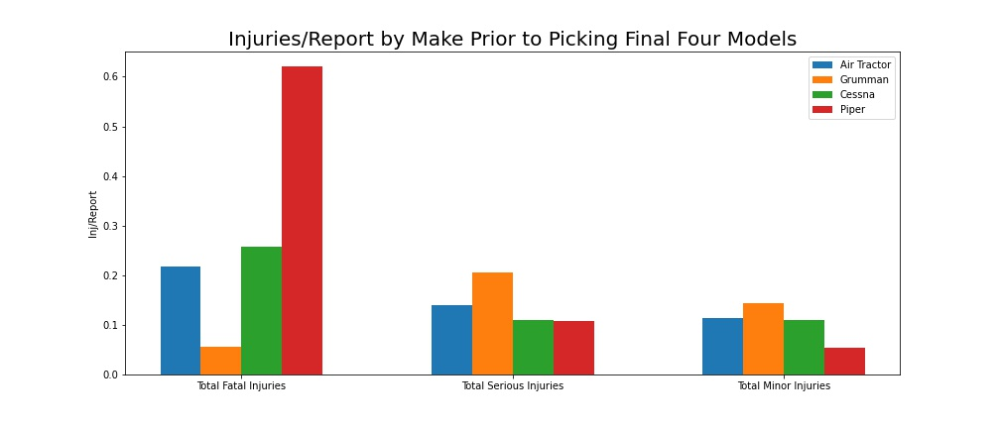

# Aviation Data Analysis
## Authors: Danayt Aman, Heath Jones, and David Hartsman

### Overview

In this project, we analyzed a dataset composed of 90,000+ FAA records. The original data contained information from reports - events where aircrafts experienced damage or malfunctions. The data contained reports from a variety of different types of aircrafts. In many cases, the data were quite persuasive in demonstrating the enhanced safety of certain aircrafts over others.

### Business Problem

Our task was to provide advice and insight to a business group that intends on entering the aviation industry, specifically about airplanes. Our team spent the week examining the last 20 years of accident reports, with the aim of identifying the safest airplane models and manufacturers. We decided to focus on the past 20-year period because it represents post-9/11 data, and we felt that our clients would be primarily interested in assessing modern airplanes, as opposed to outdated, less technologically advanced planes. To ensure a comprehensive evaluation, we focused our research on three distinct industry sectors: aerial application, private planes, and commercial planes. This allowed us to delve deeper into the specific safety considerations within each sector and provide useful recommendations.

### Data 

The data had records dating back to 1948. Every record corresponded to an official report to the FAA. The information in the reports pertained to the number of people on board, both injured and uninjured, the status of the plane, the purpose of the flight, and many other pieces of information. In many cases, the records were missing information, sometimes only for a few columns and sometimes for many fields of an entry. 

### Methods

We filtered through the dataset, removing entries from vehicles that were not airplanes. To capture the most representative subset of the dataset, we removed records before the year 2003. We also created categorical columns, dropped certain extraneous information, and imputed selected missing values. We employed inferential statistics to draw meaningful insights from a sample of more than 100 different specific airplane models that occurred most often in our data. This statistical approach allowed us to make reliable determinations and draw conclusions about the safety of various airplane models and manufacturers. We examined several critical factors, including fatality rates, injury severity, weather resistance, and aircraft structural resilience.

### Conclusions

Our recommended plane in the small/private aircraft industry is the Beech 35 and the Cessna 208B. Factors we considered are Injury severity, fatality rate as well as aircraft damage. Beech 35 had the least fatality rate with a rate of 0.17 and cessna 208B was the second best with 0.28. Our first option the Beech 35 also had the least destroyed aircraft damages from the avg accidents.

In the large/commercial aircraft category, we determined that the Boeing 767 and the Boeing 747 carried the least risk. These wide-body airplanes boasted the two lowest fatality rates for large planes, and showed very low fatality injuries per accident. The two aircraft also offer 2-engine (767) and 4-engine (747) diversity, allowing our stakeholders to enter the commercial market from multiple angles.
For aerial application, we recommend the Grumman 164 and the Air Tractor 301. 

    
    
These planes earned our recommendation because of their exceptional  record for limiting deadly accidents and for rarely being totally destroyed. They both performed well in assessments related to weather as well.

In summary, we conducted extensive data cleaning, exploratory analysis, and attempted to identify key stats to track to evaluate the quality of different airplanes.  The airplanes we determined to be best in class are: SMALLPLANES, the Boeing 767 and 747 for commercial use, and the Grumman 164 and Air Tractor 301 for aerial application. These planes compared favorably to other models in their industry, and we feel that we can offer our strong recommendation.
      
### For More Information
See our [Jupyter Notebook](https://github.com/heefjones/phase_1_project/blob/main/final_notebook.ipynb) or take a look at our [presentation](https://docs.google.com/presentation/d/1tfe3cDrtg7xirmz7nWk67luRpMLj_LHo1zjpqQQJzuo/edit#slide=id.p).
